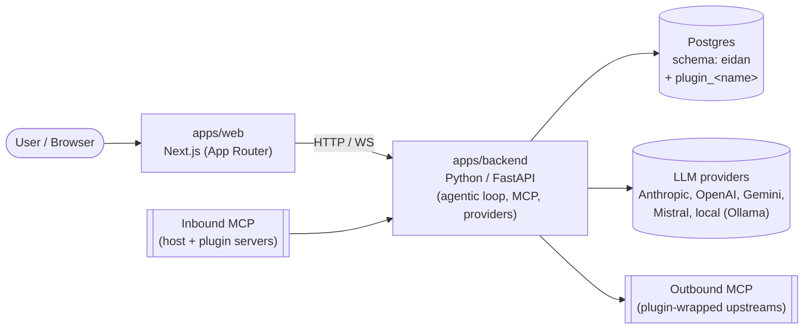

# 🧙🏾‍♂️ Eidan

**Self-hosted personal agent OS for builders. Own your cognitive infrastructure.**

> Think about your personal `Jarvis`&trade;. A bit wiser than `Dum-E`&trade;, but not yet `Vision`&trade; level.

<p align="center">

</p>

You run Eidan on your own server, computer, raspberry, pod, whatever. It keeps the long-running memory — your conversations, notes, and whatever your tools feed in — in a Postgres database that's yours to read, back up, and walk away with. New features arrive as plugins: one folder can add backend code, a UI screen, its own database tables, agentic behaviours, and an MCP server. 

The Core is open source **forever**.

You can write plugins by yourself, or purchase [pre-packaged sets](https://eidan.dev).

Built for 🌻 neurodivergent builders, 🤖 indie hackers, and solo founders who want cognitive continuity without SaaS lock-in.

## Quick start

The shortest path to a running agent. Assumes Docker + VS Code on your host
machine. Full walkthrough with vendor screens and troubleshooting lives in
[LOCALHOST](./docs/LOCALHOST.md).

**On your host machine** (not in the dev container yet):

```bash
git clone https://github.com/sielay/eidan.git && cd eidan
cp .env.example .env
```

Open `.env` and fill in two values (everything else has dev defaults):

```bash
ANTHROPIC_API_KEY=sk-ant-...                              # console.anthropic.com → API Keys
EIDAN_AUTH_MASTER_KEY=$(python -c "import secrets; print(secrets.token_urlsafe(48))")
EIDAN_AUTH_ALLOWED_EMAIL=you@example.com                  # the only address that can log in
```

Open the repo in VS Code → **Reopen in Container** (3-5 min first build).
The dev-container compose stack brings up Postgres + a Caddy reverse
proxy alongside the app; no host-side services needed.

**Inside the dev container:**

```bash
make doctor && make migrate && make login
# `make login` mails a magic link via SMTP (when configured) and
# always prints it to the backend log; in dev mode the link is also
# echoed back on the response body so you can click without SMTP.
```

Now pick a surface:

- **CLI REPL:** `make repl` — type at your agent in the terminal, `Ctrl+D` to leave.
- **Web UI + backend together:** `make dev` (or `pnpm dev`) — runs FastAPI on
  `:8000` and Next.js on `:3001` behind a Caddy reverse proxy on `:3000`.
  Open [http://localhost:3000](http://localhost:3000) — single origin, no
  CORS dance.

That's it. For bare metal, standalone Postgres, deployment, or
troubleshooting see [Other easy ways to start](#other-easy-ways-to-start)
below.

## Other easy ways to start

Three surfaces talk to the same agent loop, all backed by the same Postgres memory:

- **CLI REPL** — `make repl`, fastest dev iteration; runs the loop in-process.
- **FastAPI HTTP server** — `make server` runs the backend; the CLI speaks to it remotely when `EIDAN_BACKEND_URL` is set. Same shape production uses.
- **Web UI** — `apps/web` (Next.js, App Router) for the browser. See the [Phase 1 UI surface →](./docs/014_UI_SURFACE.md) for what's shipped.

Pick where to host them:

| Path | When to pick | Where |
|------|--------------|-------|
| **Dev container** *(recommended for local)* | You have Docker + VS Code. Python, Postgres, and a Caddy reverse proxy come prewired. ~5 minutes. | [→ devcontainer quickstart](./docs/LOCALHOST.md#quickstart-via-devcontainer-recommended) |
| **Bare metal** | You'd rather install Python / Postgres / Node yourself, or you're targeting a Pi. ~15 minutes. | [→ bare-metal walkthrough](./docs/LOCALHOST.md#0-prerequisites) |
| **Full-stack deploy** | Hosted backend + web UI exposed to a browser; single-host Fly, Pi cluster, multi-instance. Run `eidan init <name>` once to scaffold your private ops repo; `eidan deploy` reconciles every node from `topology.yml`. | [→ deployment guide](./docs/DEPLOYMENT.md) |

Auth is native — magic-link sign-in against a single-operator
allow-list (`EIDAN_AUTH_ALLOWED_EMAIL`), an RS256 JWT minted by the
host, and an encrypted secrets vault in Postgres. No Supabase project,
no JWKS round-trip. The full flow is pinned in [AUTH FLOW](./docs/011_AUTH_FLOW.md);
the vault model is in [SECRETS](./docs/012_SECRETS.md).

Plugins under `plugins/` load automatically. Core ships two:

- **`learn`** — surveys what you already know about a topic (knowledge + notes + recent messages) before the model improvises.
- **`capture`** — write-side tools the agent uses to save what it learned: `remember` (curated knowledge), `note` (working memory), `event` (calendar-like items).

Together they form the basic "agent manages your memory" loop. See [PLUGINS](./docs/001_PLUGINS.md) to add your own.

## Features

- 🧠 **Persistent memory** — events, knowledge, notes, user/agent context
- 🤖 **Agent orchestration** — long-running agents, async jobs, real-time updates
- 🔐 **Self-hosted** — your data, your infrastructure, your rules
- 🔌 **Extensible** — MCP tools, LLM integrations, custom agents, plugin-extensible end to end
- 📚 **Memory routing** — skill domains, event types, semantic organization
- 🌐 **Distributed** — optional nodes (Raspberry Pi, etc.)

### Limitation

- Single user per stack, no RLS policies.

### Extra features

 - For extra features, integrations and capcities see [eidan.dev](https://eidan.dev).
 - For enterprise level features contact [licence@eidan.dev](mailto:licence@eidan.dev)

### Community plugins

Community-sourced plugins are welcome, as long as they are released
under an AGPL-compatible licence. The
[community plugin guide](./docs/COMMUNITY_PLUGINS.md) walks through
the AGPL implications, plugin-author CLA, and what the host
contract requires of a third-party plugin.

## Architecture at a glance



The stack is **Python on the server, Next.js on the client**. The
FastAPI app in `apps/backend` owns the agentic loop, persistence, and
provider calls. It is designed to run multi-instance (Fly.io, Pi
cluster, etc.) with Postgres as the shared source of truth; work that
needs a single owner (cron, leases, sequencing) elects a leader
rather than assuming one process.

## Monorepo layout

```
├ apps/
| ├── cli/         # CLI interface for management, migrations,
| |                # and other utilities, as well agnet REPL loop 
| ├── web/         # Next.js (App Router). Plugin frontends mount here.
| └── backend/     # Python / FastAPI. Owns the agentic loop, MCP,
|                  # providers, persistence. Loads plugins.
├ packages/
| └── schemas/     # JSON Schema source of truth.
|                  # Generates @eidan/schemas (Zod + TS types)
|                  # and eidan-schemas (Pydantic v2 models).
├ plugins/
| └── <name>/      # One folder per plugin. Tier (core/pro/commercial)
|                  # declared in plugin.yaml as bundle metadata. This
|                  # repo carries only tier: core plugins; paid plugins
|                  # live in standalone private sibling repos
|                  # (see docs/018 §2) and are dropped here by
|                  # the eidan CLI.
├ migrations/
| └── versions/    # Alembic migrations on the eidan schema. Core
|                  # revisions only. RLS / cross-cutting refinements
|                  # ship from the universal paid baseline — see docs/018.
└ docs/            # Numbered specs. See docs/ARCHITECTURE.md
                   # for the canonical overview.
```

Plugins own their own Python package, Next.js routes/components,
Alembic migrations (in a per-plugin `plugin_<name>` schema, co-located
at `plugins/<name>/migrations/`), agentic behaviours, and an optional
MCP server — declared in a single `plugin.yaml` per plugin. See
[PLUGINS](./docs/001_PLUGINS.md) for the contract.

## Tool placement

The Core ships the host, the memory model, the agentic loop, 
the provider abstraction, the schemas package, and the minimal 
UI surface in [UI_SURFACE](./docs/014_UI_SURFACE.md).

Provider-specific integrations that need OAuth, vault entries, and
per-user credential rotation [SECRETS §7](./docs/012_SECRETS.md) live 
behind the plugin contract and ship via plugins.

The `events` table in core [MEMORY DDL §4](./docs/003_MEMORY_DDL.md) is 
the generic substrate; the _integration_ that imports a 
calendar provider into it is a plugin, not core.

## Memory model

Memory lives in Postgres under the `eidan` schema. Core defines eight
first-class tables:

- `conversations` — thread container.
- `messages` — append-only turn log, tree-shaped via `parent_message_id`.
- `events` — calendar-like items (due, occurred, recurring, status).
- `knowledge` — curated, skill-tagged markdown with source attribution.
- `notes` — working memory written by an agent in a conversation.
- `agent_context` — per-agent identity: code defaults + user overrides.
- `user_context` — durable user facts (identity, goals, constraints,
  preferences, projects).
- `llm_calls` — per-provider-call telemetry (tokens, cost, latency).

The full DDL is in [MEMORY DDL](./docs/003_MEMORY_DDL.md).


## Where Eidan sits

| Feature                      | Eidan                 | OpenClaw   | n8n            | Onyx              |
| ---------------------------- | --------------------- | ---------- | -------------- | ----------------- |
| **Personal OS**              | ✅ Yes                | Partial    | No             | No                |
| **Persistent memory**        | ✅ Events + knowledge | Basic      | Stateless      | Knowledge-only    |
| **Multi-agent**              | ✅ Coordinated        | Fragmented | Workflow-based | Enterprise search |
| **Local-first**              | ✅ Default            | Yes        | Optional       | Cloud-only        |
| **Self-hosted**              | ✅ Easy               | Complex    | Yes            | No                |
| **Memory routing**           | ✅ Skill domains      | No         | No             | No                |
| **Open source**              | ✅ AGPL               | Yes        | Yes            | No                |
| **Designed for individuals** | ✅ Yes                | Developers | Teams          | Enterprise        |
| **One-click deploy**         | ✅ <5 clicks          | 20+ steps  | 10+ steps      | SaaS only         |

**Eidan is for:** personal cognitive continuity, life orchestration, neurodivergent support, indie hacker autonomy.

**OpenClaw is for:** developers building agent systems (infrastructure-heavy).

**n8n is for:** workflow automation (deterministic, not cognitive).

**Onyx is for:** enterprise AI search (knowledge retrieval, not agentic).

### Adjacent, not competing — Gas Town

[Gas Town](https://github.com/gastownhall/gastown) and Eidan get
compared because both orchestrate AI agents and both think hard
about persistence, but they sit in different categories.

| | Gas Town | Eidan |
|---|---|---|
| Unit of value | A *fleet* of coding agents | *One* personal agent |
| Domain | Coding only | Lifestyle / business / coding |
| Substrate | Git worktrees + Beads + DoltHub | Postgres (`eidan.*`) |
| Surface | Terminal + tmux | Web UI + backend service |
| Topology | Federated (Wasteland) | Single-operator, multi-instance |
| Mental model | Kubernetes for coding agents | Jarvis |

If your problem is *"I have a team of coding agents — how do I keep
them coordinated?"*, Gas Town is the right tool. If your problem is
*"I want one assistant who actually knows me across the parts of my
life I care about,"* that's Eidan. The two coexist cleanly — Gas
Town's coding swarm is upstream of Eidan's coding bundle, not a
substitute for the host.

## Status

Eidan is the second iteration of SIELAY personal agent framework. It's still in active development. Expect breaking changes. Version migrations tools will be provided. Contributions are welcome.

## Licensing

- **Core runtime** (AGPL v3) — free, self-hosted, source open
  forever.
- **Paid plugin sets** — pre-packaged plugins available at
  [eidan.dev](https://eidan.dev).
- **Commercial, serviced, hosted or custom** — contact
  [licence@eidan.dev](mailto:licence@eidan.dev).

Community plugins must be AGPL-compatible. See
[`LICENSE.md`](./LICENSE.md) and [`CONTRIBUTING.md`](./CONTRIBUTING.md)
for details.

## Documentation

Start here:

- [`docs/ARCHITECTURE.md`](./docs/ARCHITECTURE.md) — system design,
  memory topology, agent lifecycle.
- [`docs/GLOSSARY.md`](./docs/GLOSSARY.md) — cross-spec term index,
  grouped by area + suggested reading order for newcomers.
- [`docs/LOCALHOST.md`](./docs/LOCALHOST.md) — full walkthrough for
  the dev-container and bare-metal paths.

Deploying & operating:

- [`docs/DEPLOYMENT.md`](./docs/DEPLOYMENT.md) — single-host /
  multi-instance deploy notes and the `EIDAN_AUTH_MASTER_KEY` /
  SMTP setup checklist.
- [`docs/018_DISTRIBUTION_AND_BUNDLES.md`](./docs/018_DISTRIBUTION_AND_BUNDLES.md) —
  how core + paid sibling bundles fit together.

Extending Eidan:

- [`docs/001_PLUGINS.md`](./docs/001_PLUGINS.md) — the plugin contract
  (manifest, lifecycle, MCP).
- [`docs/COMMUNITY_PLUGINS.md`](./docs/COMMUNITY_PLUGINS.md) — AGPL
  implications + CLA for plugin authors.
- [`docs/025_AGENT_DB_INTROSPECTION.md`](./docs/025_AGENT_DB_INTROSPECTION.md) —
  the whitelisted read surface the agent uses to introspect its
  own state.
- [`CONTRIBUTING.md`](./CONTRIBUTING.md) — development workflow,
  contributor CLA.

The numbered `docs/0NN_*.md` files are the authoritative specs;
each opens with a `Related:` block that threads the graph.

## Community

- **Issues** — ideas, feedback, architecture debates, bug reports, feature requests

## Why Eidan?

From Old English _ēodan_ (to go, move forward). Eidan is your invisible orchestrator — anticipating needs, managing complexity, enabling continuity across life domains.

Like JARVIS, but open-source and yours to own.

---

SIELAY Ltd 2026

Built by [@sielay](https://github.com/sielay) and contributors.
