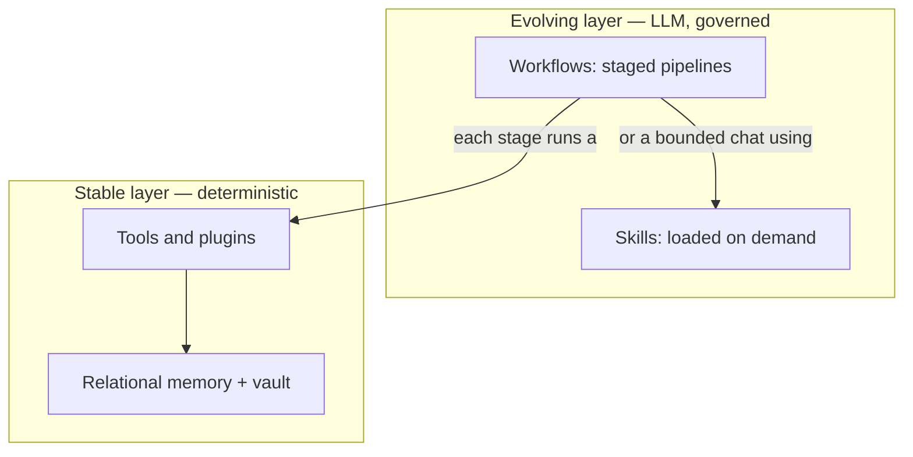

# Workflows

A **workflow** in eidan is a repeatable, staged process the agent runs — some steps are
**deterministic tools** (no model), some are **bounded LLM steps** (grounded, short-context). eidan
ships a growing library of them; this section explains each with a simple diagram so they can be
reviewed and improved.

## The shape of every workflow

eidan runs on two layers: a **stable layer** of deterministic tools/plugins, and an **evolving
layer** of LLM-driven steps (workflows + skills) that call into it. A good workflow pushes as much as
possible down to the stable layer and keeps the LLM steps short and grounded.

## The workflows

| Workflow | What it does |
|---|---|
| [Content](/workflows/content) | Plan a campaign on a board: concept → assets → copy → review → schedule, each column a gated step. |
| [Sage (coding)](/workflows/sage) | Delegate an engineering task; it branches, codes, opens a PR, and iterates to green. |
| [Agents & triggers](/workflows/agents) | A user-defined agent fires on a schedule/sensor/webhook, runs one turn, escalates when unsure. |
| [Reasoning](/workflows/reasoning) | Skills are classified per turn and loaded on demand; cognition adds inner-voice critique. |
| [Rethinking](/workflows/rethinking) | Resolve unknown terms just-in-time (rumsfeld); get a second opinion before committing. |

:::note These are review drafts
The diagrams are meant to be read, argued with, and refined — if one doesn't match how a workflow
actually behaves, that's a doc bug worth fixing. Edit the page on
[GitHub](https://github.com/sielay/eidan/tree/main/docs-site/docs/workflows).
:::
