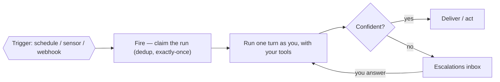

# Agents & triggers

A user-defined **agent** is a persona + its own model + one or more **triggers**. When a trigger
fires, the agent runs **one bounded turn** under your identity, with your tools — and lands an item in
your escalations inbox instead of guessing when it's unsure. See [Build an agent](/guides/build-an-agent).

**Exactly-once across nodes:** many nodes may poll, but a unique claim on the fire key means one wins
— so a schedule fires once no matter how many nodes run. Agents can also **relate** to each other
(delegate down, escalate up), which is how a multi-agent org coordinates through shared state.
