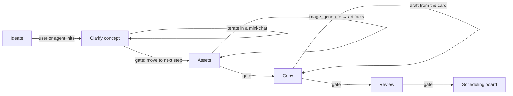
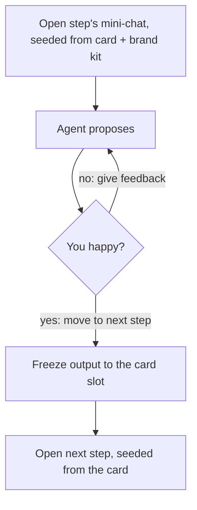
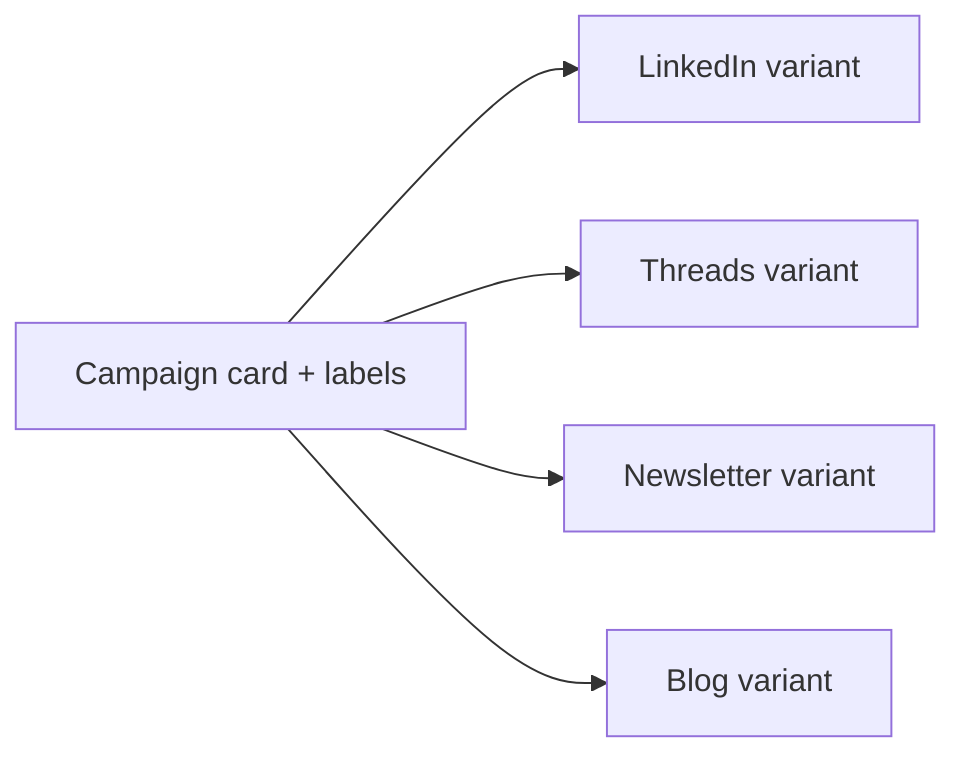

# Content workflow

Plan a piece of content as a **card on a board**. Each column is a **step**; each step is either a
deterministic tool or a **bounded, iterative mini-chat**; moving a card to the next column is an
**approval gate**. The card is the durable home for everything (brief, prompts, images, copy), so
chats never have to remember the whole history — nothing drifts, nothing is lost.

## The pipeline

## A step is a container, not one call

Within a column you go back and forth with the agent — using that step's skills and memory — until it
lands. Advancing **freezes the result onto the card** and opens the next step's chat, seeded from the
card. The next step reads the frozen output, not the transcript.

## Fan-out to channels (repurposing)

Labels on the card target channels and pick the format. Each target spins a **swimlane / variant
card**, so one concept becomes many channel-optimized posts.

## Grounding = no hallucination

Copy is drafted from the card's own stored prompts + images + the venture **brand kit** (voice,
styleguide, reference images), not from you re-pasting into a fresh chat. Deterministic steps (image
generation, attach, schedule, post) use no model at all.

> Design detail: workflows are shipped as hardcoded config (a `WorkflowDef` per flow), the engine and
> board are generic, and the brand kit + card are the per-venture / per-piece data that layer in.
