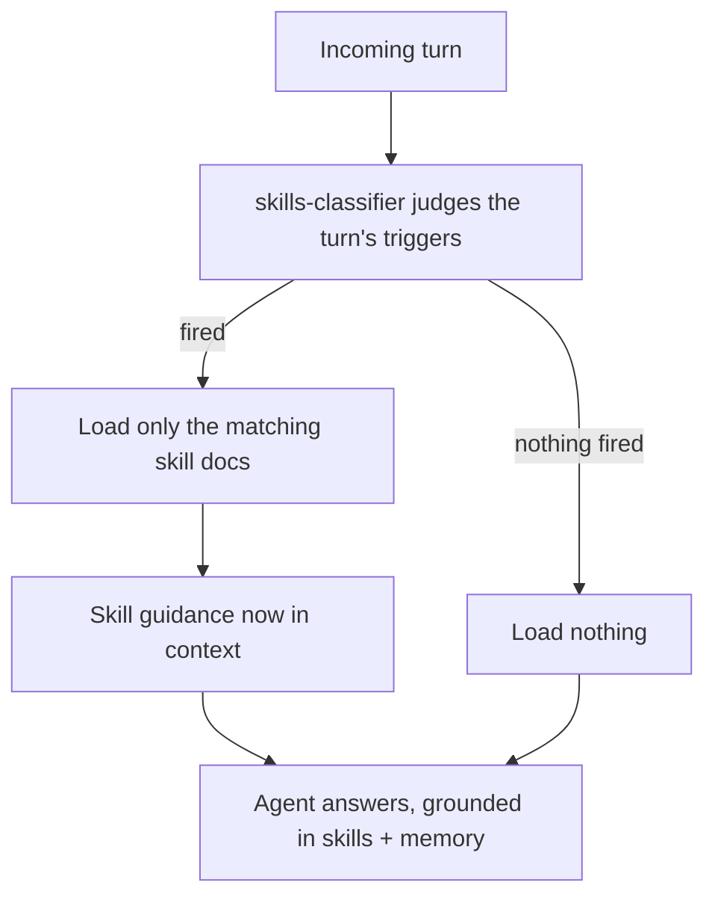

# Reasoning — skills & cognition

eidan keeps the context window clean by **loading knowledge only when a turn needs it**. A small
classifier judges which skills a turn triggers and loads just those; cognition adds optional
higher-order skills (like a second opinion).

## Skills — progressive disclosure

A compact index of every skill is always visible (so the model knows what exists), but full skill
bodies load on demand — a large library never floods the window.

## Cognition — higher-order skills

The `cognition` plugin seeds built-in cognitive skills into the same store:

- **Inner voice** — an opt-in bicameral critique of the latest answer (see [Rethinking](/workflows/rethinking)).
- **Remember this** — capture a durable piece of knowledge into the memory graph mid-turn.
- **Dream time** — offline reflection / consolidation.

These are just skills, so they ride the same classify-and-load path above.
