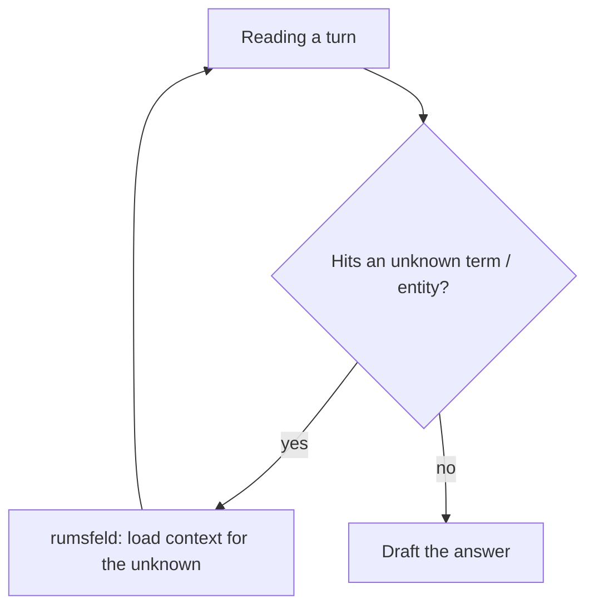
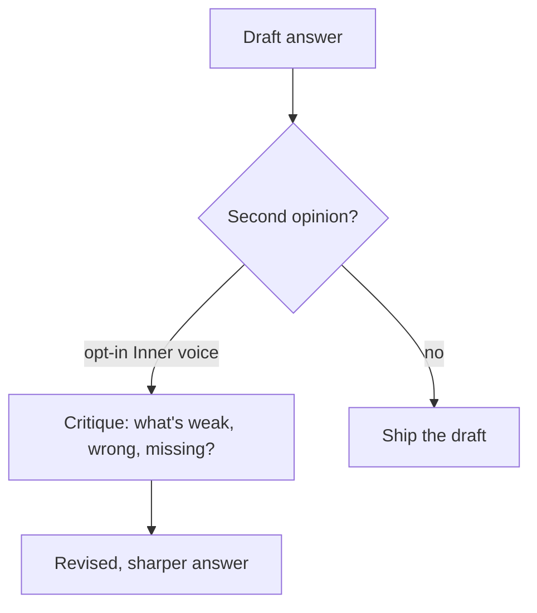

# Rethinking — resolve unknowns, then double-check

Two matbot patterns keep answers honest: **rumsfeld** resolves things the model doesn't know *before*
it answers, and **inner voice** critiques an answer *after* it's drafted.

## Rumsfeld — resolve unknowns just-in-time

When a turn references a term, entity, system, or concept the agent doesn't know, it loads context for
that unknown instead of guessing.

## Inner voice — a second opinion before committing

An opt-in bicameral critique: draft an answer, then have a second pass challenge and sharpen it. It's
a `cognition` skill, off by default, invoked when you want the extra rigor.

Together: **don't answer around a gap** (resolve it first), and **don't ship the first draft blind**
when it matters (critique it).
