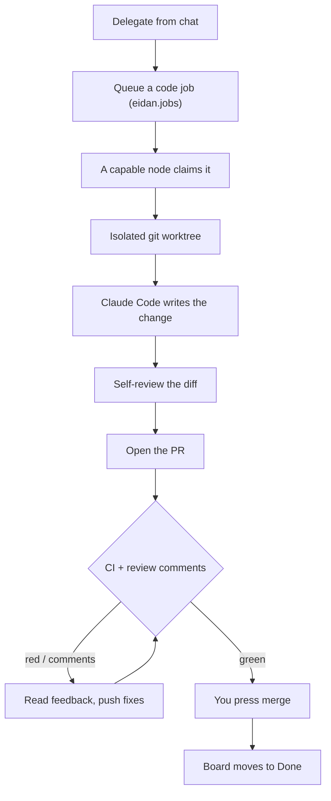

# Sage — the coding workflow

Delegate an engineering task in plain language; Sage does the loop and opens a PR for you to merge.
See the [Sage bundle](/bundles/sage) and the [Delegate to Sage guide](/guides/delegate-to-sage).

**Why it's reliable:** every job runs in its own worktree (same-repo tasks never collide), the diff is
self-reviewed before the PR, and the board mirrors GitHub on its own — a merged PR moves to Done, a
failing one back to Needs work. Sage never auto-merges; when it gets stuck it
[escalates](/workflows/agents) to you.
