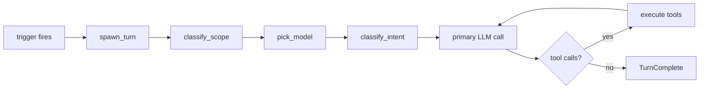
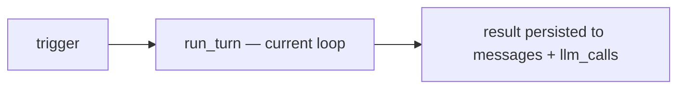
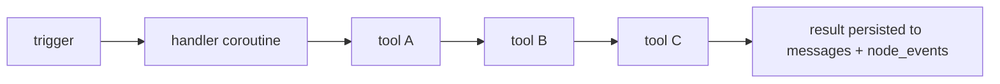
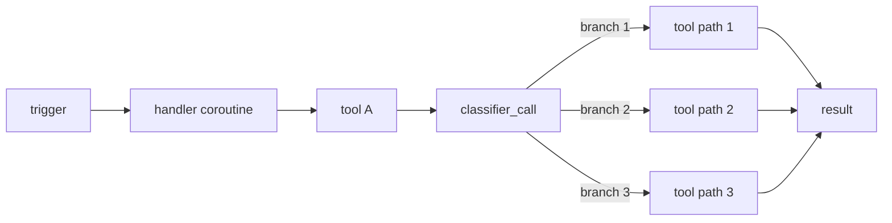
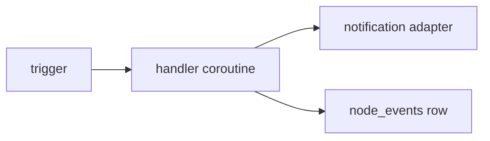
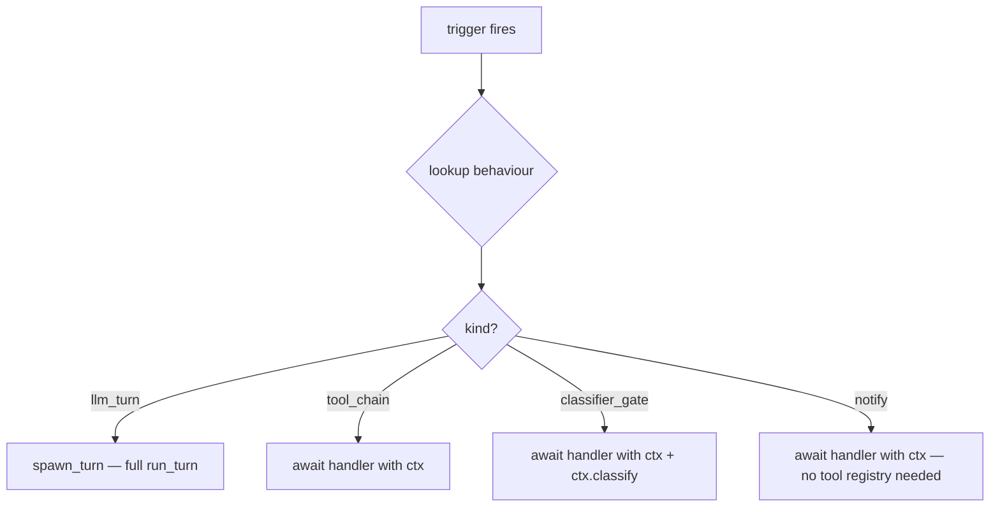

# 026 — Behaviour dispatch kinds

Status: Draft
Owner: Core
Related:
  `docs/001_PLUGINS.md §5` (behaviour declarations and triggers),
  `docs/005_AGENTIC_LOOP.md` (the LLM-driven turn loop),
  `docs/006_BEHAVIOURS_TRIGGERS.md` (the `intent:` classifier surface)

This spec defines **how** a triggered behaviour is dispatched,
which is orthogonal to **what** triggers it (the
`event:` / `cron:` / `webhook:` / `schedule:` / `agent:`
grammar in `001_PLUGINS.md §5.1`) and orthogonal to the
`intent:` classifier surface owned by `006`.

Today every triggered behaviour funnels through
`run_agent_initiated_turn` → `run_turn`, which means a fixed
classifier cascade fires on every trigger: scope classifier,
sizer, intent classifier, primary call, tool dispatch. That is
the right shape when the behaviour needs the model to *decide*
what to do. It is wasteful when the behaviour already knows
what to do.

## 1. Today's flow (universal)



Every step is paid every cycle, including for behaviours whose
work is a fixed recipe. Consider a hypothetical behaviour
whose handler is meant to:

```
step A → step B → step C → emit notification
```

Where the ordering, the tools, and the success condition are
all known up front. There is no decision the orchestrator LLM
is genuinely making — yet two classifier calls plus a primary
fire each time the trigger lands. On a slow node that's
minutes of CPU per fire, on an expensive provider that's
unbudgeted tokens per fire.

## 2. The four kinds

| Kind                | Orchestrator                  | When to pick                                                  |
|---------------------|-------------------------------|---------------------------------------------------------------|
| **`llm_turn`**      | Full `run_turn` loop          | The behaviour needs the model to decide what to do next        |
| **`tool_chain`**    | Async Python coroutine        | The steps + ordering are known up front; no LLM in the chain   |
| **`classifier_gate`** | Coroutine + one classifier call | A single LLM decision picks a branch; the rest is deterministic |
| **`notify`**        | Direct emit                   | No agent work — write a row, call a notification adapter       |

### 2.1 `llm_turn` — the thought loop

Same as today. The canonical case is an introspective tick:
read recent activity, decide whether to escalate. Future
operator-spawned prompts ("what's outstanding?") fit here too.



### 2.2 `tool_chain` — deterministic recipe

The handler is an `async def` that takes a `ctx` (same tool
registry as a turn would have, no provider injection) and
calls tools in sequence.



Skeleton:

```python
async def on_event(ctx, event):
    a = await ctx.tools.step_a(event.payload)
    b = await ctx.tools.step_b(a)
    if not b.changed:
        await ctx.tools.notify_noop(event)
        return
    await ctx.tools.step_c(b)
```

If a tool the handler calls happens to invoke an LLM
internally (a workflow-style subprocess, an embedding call, a
provider tool that wraps a model), it still writes its own
`llm_calls` row at the right layer. The **orchestration** is
deterministic; the **work** still uses an LLM where one is
load-bearing.

### 2.3 `classifier_gate` — branch on a single classifier

Same shape as `tool_chain`, plus one classifier call at a
branch point. The classifier is invoked **directly** as an
async helper, not through `run_turn`.



Skeleton:

```python
verdict = await ctx.classify(
    prompt_path="prompts/triage.md",
    inputs={"input": event.payload},
    schema=Verdict,
)
match verdict.action:
    case "act":      await ctx.tools.act(...)
    case "reply":    await ctx.tools.reply(...)
    case "ack":      await ctx.tools.ack(...)
    case "escalate": await ctx.escalate(...)
```

The classifier itself writes an `llm_calls` row with role
`behaviour_classifier` (already in the constraint per
`003_MEMORY_DDL.md §9`).

### 2.4 `notify` — no agent, no LLM

The behaviour writes a side effect and returns. No `messages`
row (it isn't a conversation), one `node_events` row for
auditability, optional notification-adapter emit.



Canonical case: a scheduled reminder that posts a message to a
channel. Trigger fires, message goes out, done.

## 3. Manifest declaration

`kind:` joins the existing behaviour fields in
`plugin.yaml` (`001_PLUGINS.md §5`). Default is `llm_turn` so
every existing manifest keeps working.

```yaml
behaviours:
  - id: example:tick
    trigger: schedule:PT5M
    handler: my_plugin.handlers:tick
    kind: llm_turn               # default — explicit for clarity

  - id: example:on_event
    trigger: event:my_plugin.thing_happened
    handler: my_plugin.handlers:on_event
    kind: tool_chain

  - id: example:triage
    trigger: event:my_plugin.thing_settled
    handler: my_plugin.handlers:triage
    kind: classifier_gate

  - id: example:reminder
    trigger: cron:0 9 * * *
    handler: my_plugin.handlers:reminder
    kind: notify
```

## 4. Dispatch



The dispatcher lives where `_make_spawn_turn_callable` lives
today (`apps/backend/eidan_backend/bootstrap.py`). Today's
helper wraps `run_agent_initiated_turn`; the new dispatcher
adds three sibling helpers that build a lighter `ctx` for each
non-`llm_turn` kind (same tool registry, no provider for
`tool_chain` / `notify`, classifier helper exposed for
`classifier_gate`).

## 5. `ctx` surfaces

| Kind              | `ctx.tools` | `ctx.classify` | provider injection |
|-------------------|-------------|----------------|--------------------|
| `llm_turn`        | via run_turn | n/a (loop owns it) | yes                |
| `tool_chain`      | yes         | no             | no                 |
| `classifier_gate` | yes         | yes (helper)   | yes (cheap-model only) |
| `notify`          | optional    | no             | no                 |

The `ctx` for non-`llm_turn` kinds intentionally exposes less
surface than a turn's `ctx`. Conversation persistence is
opt-in: the handler may call `ctx.write_event(...)` to drop a
`node_events` row, or `ctx.write_messages(...)` if it wants
the work to show up in the conversation list so the operator
sees the deterministic chain in the UI alongside its
LLM-driven peers.

## 6. Backwards compatibility

`kind:` is optional; omitting it means `llm_turn` (today's
behaviour). Every existing manifest keeps working. Plugin
authors opt down to lighter kinds as they see fit.

The migration is also additive on the loop side — the
dispatcher gains three new branches; `run_turn` is unchanged.

## 7. Open questions

- **Telemetry for `tool_chain`.** Today `llm_calls` is keyed
  on the user message. `tool_chain` writes none directly — but
  the tools it calls do. Is that enough? Probably yes; revisit
  if the operator-facing cost dashboard wants a per-handler
  rollup row.
- **Escalation envelope from `tool_chain` / `notify`.** Today
  `eidan.escalations` is written by the loop's failure
  classifier. A failing `tool_chain` should still be able to
  write one. Either: expose `ctx.escalate(...)` (proposed in
  §5), or auto-write on uncaught exception.
- **Where the classifier prompt + schema live.** §2.3's
  `prompt_path` points into the plugin's `prompts/` dir. The
  schema lives in `packages/schemas/` if it crosses a process
  boundary, in the plugin otherwise.
- **`llm_turn` with tool-loop bypass.** Some `llm_turn`
  behaviours might want the classifier overhead but no tools
  on the primary call (a pure-text introspection). That's an
  optimisation of `llm_turn`, not a separate kind. Defer.

## 8. Migration plan

Two slices in core:

1. **Schema + dispatcher.** Add `kind:` to
   `PluginManifest.schema.json` (default `llm_turn`); rewrite
   the bootstrap dispatcher to branch on it; tests for each
   branch.
2. **Re-tag in-tree behaviours.** Behaviours under
   `plugins/` whose handlers don't need the full turn loop
   move to `tool_chain` (or `notify`). The default keeps the
   rest unchanged.

Downstream plugin trees adopt the kinds incrementally — each
plugin author picks the right kind per behaviour without any
host-side change.

## 9. Out of scope

- The `intent:` trigger surface owned by `006` — that document
  and this one are orthogonal axes (when does it fire vs. how
  is it dispatched).
- The shape of `ctx.classify` (helper signature, schema
  inference, retry policy) — own follow-up; keep this doc
  about the kinds.
- Conversation-introspection UI work tracked under the epic
  in #151 — that surface improves regardless of which kind a
  behaviour picks.
