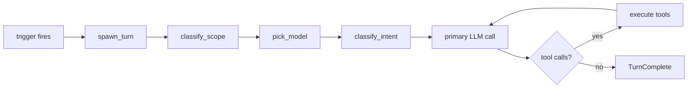
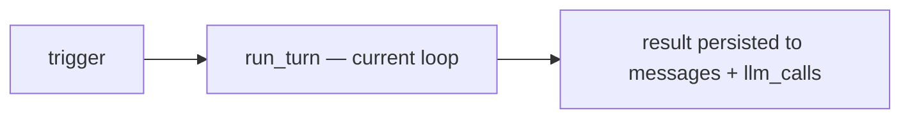
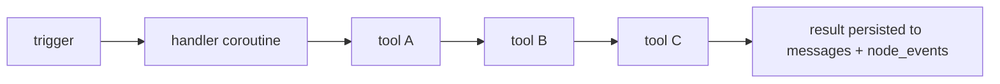
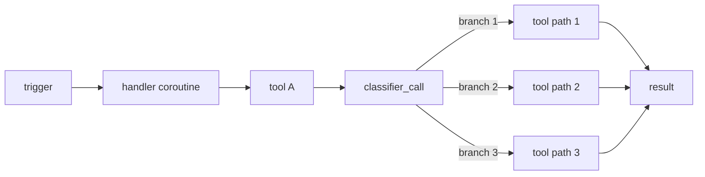
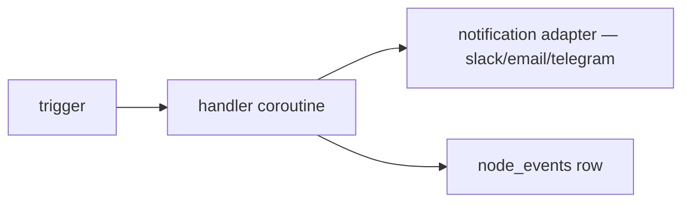
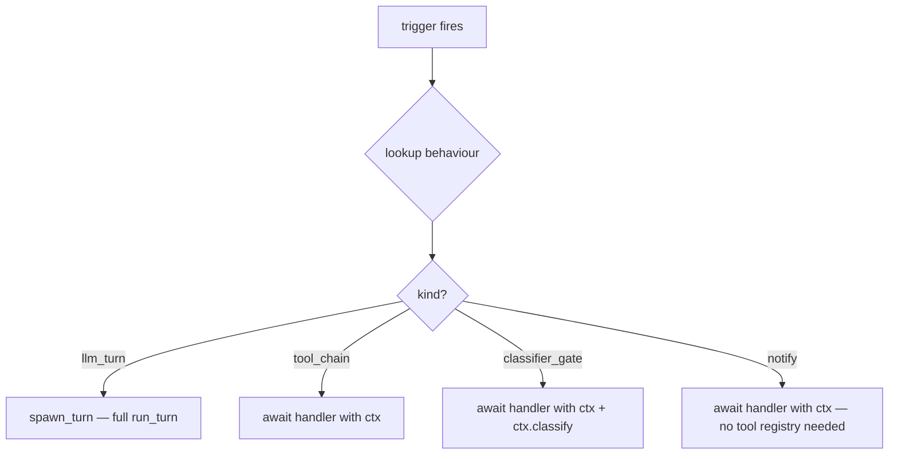

# 026 — Behaviour dispatch kinds

Status: Draft (operator-aligned 2026-06-03)
Owner: Core
Related:
  `docs/001_PLUGINS.md §5` (behaviour declarations and triggers),
  `docs/005_AGENTIC_LOOP.md` (the LLM-driven turn loop),
  `docs/006_BEHAVIOURS_TRIGGERS.md` (the `intent:` classifier),
  `../eidan-sage/docs/ROADMAP.md` (step 5 motivation)

This spec defines **how** a triggered behaviour is dispatched —
which is orthogonal to what triggers it (the `event:` / `cron:` /
`schedule:` / `webhook:` / `agent:` grammar in `001_PLUGINS.md`)
and orthogonal to the `intent:` classifier surface owned by
`006`.

Today every triggered behaviour funnels through
`run_agent_initiated_turn` → `run_turn`, which means: scope
classifier + intent classifier + (sizer) + primary call + tool
dispatch on every fire. That is the right shape when the
behaviour needs the model to *decide* what to do. It is wasteful
when the behaviour already knows what to do.

## 1. Today's flow (universal)



Every step is paid every time, including for behaviours whose
work is a fixed recipe. The first concrete miss is sage's
`task.claimed` event — clone, run claude code, commit, push,
open PR — no decision the orchestrator LLM is genuinely making.

## 2. The four kinds

| Kind                | Orchestrator           | When to pick                                                  |
|---------------------|------------------------|---------------------------------------------------------------|
| **`llm_turn`**      | Full `run_turn` loop    | The behaviour needs the model to decide what to do next       |
| **`tool_chain`**    | Async Python coroutine  | The steps + ordering are known up front; no LLM in the chain  |
| **`classifier_gate`** | Coroutine + 1 classifier call | A single LLM decision picks a branch; the rest is deterministic |
| **`notify`**        | Direct row write + notification adapter | No agent work at all — just emit a side effect |

### 2.1 `llm_turn` — the thought loop

Same as today. Sentry's periodic tick is the canonical case —
introspect over recent activity, decide whether to escalate.
Future operator-spawned prompts ("what's outstanding?") fit
here too.



### 2.2 `tool_chain` — deterministic recipe

The handler is an `async def` that takes a `ctx` (same tool
registry as a turn would have, no LLM) and calls tools in
sequence.



**Canonical case** — sage's `on_task_claimed`:

```python
async def on_task_claimed(ctx, event):
    ws = await ctx.tools.git_ensure_workspace(event.repo, event.issue)
    result = await ctx.tools.claude_run(ws, prompt=event.issue.body)
    if not result.changed:
        await ctx.tools.gh_issue_comment(event.issue, "No changes needed.")
        return
    await ctx.tools.git_commit(ws, message=f"work on #{event.issue.number}")
    await ctx.tools.git_push(ws)
    await ctx.tools.sage_open_pr(ws, issue=event.issue)
```

Tools the handler calls still write their own `llm_calls` rows
where they invoke a model (Claude Code via `claude_run`, the
critic inside `sage_open_pr`). The **orchestration** is
deterministic; the **work** still uses the right LLM.

### 2.3 `classifier_gate` — branch on a single classifier

Same shape as `tool_chain`, plus one classifier call at a
branch point. The classifier is invoked **directly** as an
async helper, not through `run_turn`.



**Canonical case** — step 5's `pr_iteration`. Triage each
Copilot inline comment:

```python
verdict = await ctx.classify(
    prompt_path="prompts/triage_copilot_comment.md",
    inputs={"comment": comment, "diff": diff},
    schema=CopilotVerdict,
)
match verdict.action:
    case "fix":      await fix_and_push(...)
    case "reply":    await post_reply(...)
    case "ack":      await mark_resolved(...)
    case "escalate": await ctx.escalate(...)
```

The classifier itself writes an `llm_calls` row with role
`behaviour_classifier` (already in the constraint per `003 §9`).

### 2.4 `notify` — no agent, no LLM

The behaviour writes a side effect and returns. No `messages`
row (it isn't a conversation), one `node_events` row for
auditability, optional notification-adapter emit.



Canonical case: calendar's "event at 09:00 → post to
#standup". The trigger fired, the message went out, done.

## 3. Manifest declaration

`kind:` joins the existing behaviour fields in
`plugin.yaml` (`001_PLUGINS.md §5`). Default is `llm_turn` so
every existing manifest keeps working.

```yaml
behaviours:
  # sentry — thought loop, current behaviour
  - id: sentry:tick
    trigger: schedule:PT5M
    handler: eidan_sentry.handlers:tick
    kind: llm_turn

  # sage — deterministic recipe (the case that started this doc)
  - id: sage:on_task_claimed
    trigger: event:eidan_git.task.claimed
    handler: eidan_sage.handlers:on_task_claimed
    kind: tool_chain

  # step 5 — branch on a classifier
  - id: sage:pr_iteration
    trigger: event:eidan_gh.pr.settled
    handler: eidan_sage.handlers:pr_iteration
    kind: classifier_gate

  # calendar — just emit (when calendar plugin lands)
  - id: calendar:event_reminder
    trigger: schedule:user_calendar_event
    handler: eidan_calendar.handlers:notify
    kind: notify
```

## 4. Dispatch



The dispatcher lives where `_make_spawn_turn_callable` lives
today (`apps/backend/eidan_backend/bootstrap.py`). Today's
helper wraps `run_agent_initiated_turn`; the new dispatcher
adds three sibling helpers that build a lighter `ctx` for each
non-`llm_turn` kind (same tool registry, no provider for
`tool_chain` / `notify`, classifier helper exposed for
`classifier_gate`).

## 5. ctx surfaces

| Kind              | `ctx.tools` | `ctx.classify` | provider injection |
|-------------------|-------------|----------------|--------------------|
| llm_turn          | via run_turn | n/a (loop owns it) | yes |
| tool_chain        | yes         | no             | no                 |
| classifier_gate   | yes         | yes (helper)   | yes (cheap-model only) |
| notify            | optional    | no             | no                 |

The `ctx` for non-`llm_turn` kinds intentionally exposes less
surface than a turn's `ctx`. Conversation persistence is
opt-in: the handler may call `ctx.write_event(...)` to drop a
`node_events` row, or `ctx.write_messages(...)` if it wants the
work to show up in the conversation list (sage's
`on_task_claimed` probably wants this — the operator should
see the agent's deterministic chain in the UI alongside its
LLM-driven peers).

## 6. Backwards compatibility

`kind:` is optional; omitting it means `llm_turn` (today's
behaviour). Every existing manifest keeps working. Plugin
authors opt down to lighter kinds as they see fit.

The migration is also additive on the loop side — the
dispatcher gains three new branches; `run_turn` is unchanged.

## 7. Worked examples across plugins

| Plugin     | Behaviour                       | Kind              | Why                                                              |
|------------|---------------------------------|-------------------|------------------------------------------------------------------|
| sentry     | `sentry:tick`                   | llm_turn          | Genuinely introspective — "given recent activity, what to do?"   |
| sage       | `sage:on_task_claimed`          | tool_chain        | Known recipe; Claude Code is the LLM that matters                |
| sage       | `sage:pr_iteration` (step 5)    | classifier_gate   | One classifier per Copilot thread / CI failure, then deterministic |
| capture    | `capture:save`                  | tool_chain        | A capture row is written; nothing to decide                       |
| calendar   | `calendar:event_reminder`       | notify            | Trigger fires; message goes out                                    |
| calendar   | `calendar:meeting_conflict`     | classifier_gate   | Classifier picks: push / cancel / propose new slot                 |
| gh-observer (future) | `observe:new_issue`   | classifier_gate   | Classify whether it's relevant; if yes, summarise + notify         |

## 8. Open questions

- **Telemetry for `tool_chain`.** Today `llm_calls` is keyed on
  the user message. `tool_chain` writes none directly — but
  the tools it calls do. Is that enough? Probably yes; revisit
  if the operator-facing cost dashboard wants a per-handler
  rollup row.
- **Escalation envelope from `tool_chain` / `notify`.** Today
  `eidan.escalations` is written by the loop's failure
  classifier. A failing `tool_chain` should still be able to
  write one. Either: expose `ctx.escalate(...)` (proposed in
  §5), or auto-write on uncaught exception.
- **Where the classifier prompt + schema live.** §2.3's
  `prompt_path=…/triage_copilot_comment.md` points into the
  plugin's `prompts/` dir (per the eidan-sage roadmap). The
  schema lives in `packages/schemas/` if it crosses a process
  boundary, in the plugin otherwise.
- **`kind: llm_turn` with tool-loop bypass.** Some `llm_turn`
  behaviours might want the classifier overhead but no tools
  on the primary call (a pure-text introspection). That's an
  optimisation of `llm_turn`, not a separate kind. Defer.

## 9. Migration plan

Land in three slices:

1. **Schema + dispatcher.** Add `kind:` to
   `PluginManifest.schema.json` (default `llm_turn`); rewrite
   the bootstrap dispatcher to branch on it; tests for each
   branch.
2. **Re-tag existing behaviours.** Most plugins keep
   `llm_turn`; `capture` and the in-tree examples flip to
   `tool_chain` where the recipe is fixed.
3. **Sage's `on_task_claimed`.** First real `tool_chain`
   handler. Closes the load-bearing motivation for this doc.

Steps 1 + 2 land in core. Step 3 lands in eidan-sage. The
classifier_gate kind is exercised first by step 5
(`pr_iteration`) per the eidan-sage roadmap.

## 10. Out of scope

- The `intent:` trigger surface (owned by `006`) — that
  document and this one are orthogonal axes (when does it
  fire vs. how is it dispatched).
- The shape of `ctx.classify` (helper signature, schema
  inference, retry policy) — own follow-up; keep this doc
  about the kinds.
- The conversation-introspection UI (#151 + children) — that
  surface improves regardless of which kind a behaviour
  picks.
