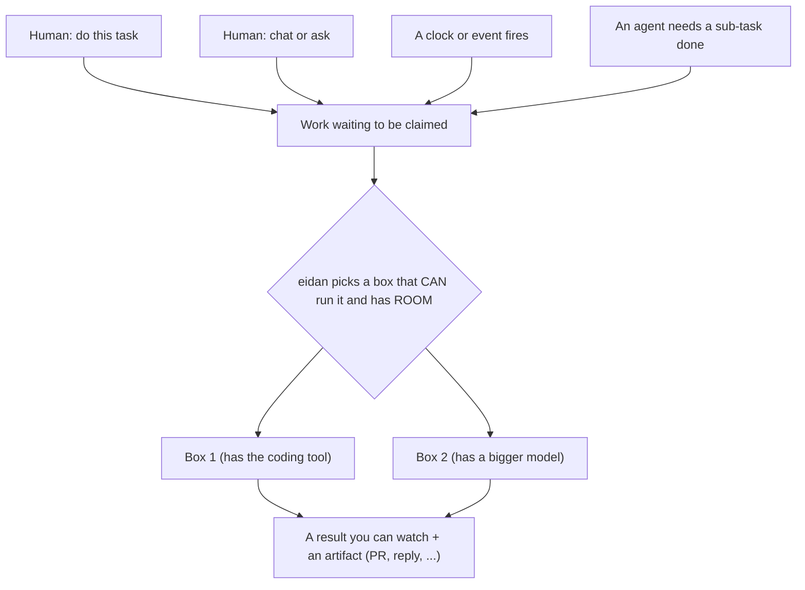
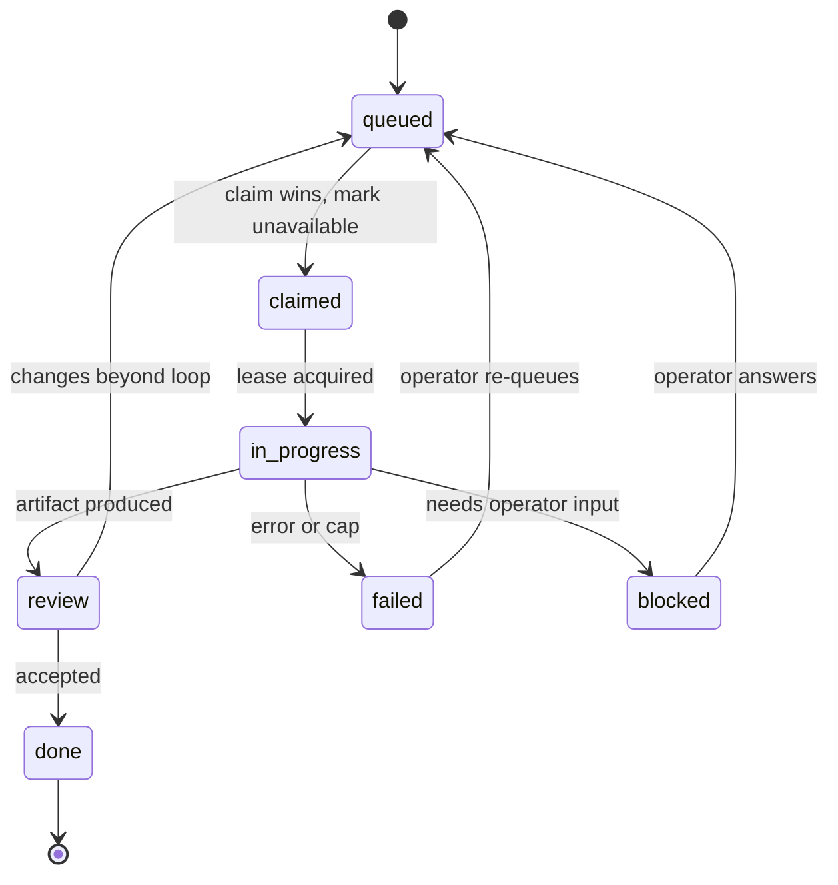

# 029 — Agent delegation & the node mesh

Status: Draft
Owner: Core
Related: `docs/008_SUBAGENT_INVOCATION.md` (the in-process spawn
primitive + depth), `docs/021_CROSS_INSTANCE_DISPATCH.md` (advisory-lock
coordination + the Phase 2 capacity-bucket vocabulary), `docs/024_NODE_TELEMETRY.md`
(heartbeats — the capability/capacity signal source), `docs/026_BEHAVIOUR_DISPATCH_KINDS.md`
(trigger kinds), `docs/027_AUTONOMOUS_LOOP_GOVERNANCE.md` ("enough" /
loop budget), `docs/028_AGENT_ACTORS.md` (who a turn runs as),
`docs/022_ESCALATION_ENVELOPE.md` (the `blocked` hook), `docs/010_COST_BUDGETING.md`
(per-scope budget gates).

**In one breath:** anything — a ticket, a chat message, a schedule, or
*another agent* — should be able to ask for work; eidan places that work
on a box that **can** run it and has **room**, runs it, and lets you
**watch** it. One box or many. This doc is the abstract contract for
that. It does **not** mandate GitHub — GitHub-issues-as-a-queue is *one*
implementation, plugged in by a bundle (§5.4).

## At a glance — the use cases



Read it as: **anything can ask for work → eidan places it on a capable,
free box → you watch it → you get an artifact.** Everything below is the
contract that makes that safe across many boxes and many agents.

## Core vs bundle — the boundary (read this first)

This is the load-bearing distinction, and the easy one to get wrong:

- **Core (this doc) owns the abstractions:** what a **work source** is,
  the **claim** handshake, **placement** by capability + capacity, the
  **state lifecycle**, and the **delegate / handoff** surface. Core never
  imports GitHub.
- **Bundles own the adapters:** the coding bundle maps the abstract work
  source + state lifecycle onto **GitHub issues + labels** (§5.4). A chat
  bundle could map them onto a different source. The adapter is where
  `bot:queue`, `gh`, and label names live — *not* core.

> **Status:** nothing here is built or published yet — this is a draft
> spec. The coding bundle's existing claim loop is the *reference* for
> §5.4, not a core dependency. The job of this doc is to pull the
> *abstract* contract up into core so the next spinning surface (chat,
> sentry, agent-to-agent) doesn't reinvent it.

This is the agent-dispatch counterpart to `021`: where `021` governs
*outbound provider calls* on shared credentials, this doc governs *agent
placement and delegation*. The primitives already exist in pieces —
`008` (in-process spawn), `024` (per-node capability via heartbeats),
`021` (cross-instance coordination), and the claim handshake (§5) — and
this doc unifies them.

Out of scope:

- **Outbound provider-call concurrency / pressure** — owned by `021`
  (capacity buckets, dispatch tokens). This doc *consumes* `021`'s
  pressure signal; it does not redefine it.
- **In-turn loop governance** (no-progress, sufficiency, loop budget) —
  owned by `027`. A delegated turn is still a turn; `027` governs it.
- **Identity / RLS / attribution mechanics** — owned by `028`. This doc
  references actor attribution; it does not redefine it.
- **The conductor-vs-deterministic-pipeline choice** for a given work
  type — that is a bundle-level execution decision (§6 names the shapes;
  the choice lives with the bundle).

---

## 1. Vocabulary

| Term | Definition |
|------|------------|
| **Node** (box) | One backend instance with a stable `node_id` (`024 §1`). May be a persistent host (e.g. a Pi) or an ephemeral cloud instance (e.g. Fly). Many nodes share one Postgres. |
| **Mesh** | The set of live nodes + the shared Postgres coordination substrate. Work is placed onto, and claimed by, nodes in the mesh. |
| **Capability** | What a node *can* do: its accepted **stacks**, installed **bundles**, **host-gated tools** (a tool that probes at activation and refuses to register if its dependency/auth is absent), and **provider/models** reachable from it. Advertised in the heartbeat (`024`). |
| **Capacity** | What a node *can take on right now*: free concurrency slots, current load, budget headroom (`010`), and `021` pressure. Distinct from capability. |
| **Work source** | Where a unit of work originates and durably lives until done: a GitHub issue, an inbound message, a behaviour firing, an agent handoff, or a user turn (§3). |
| **Placement** | Choosing which node runs a unit of work, by matching its **requirements** against node **capability** and **capacity** (§4). |
| **Claim** | The atomic act by which exactly one node takes ownership of a unit of work, safe against races between many workers (§5). |
| **Lease** | A time-bounded, renewable ownership token over a shared resource (a workspace, a slot). A dead node's lease goes stale and is reclaimable. |
| **Sub-agent / nested turn** | A turn spawned *inside* another turn via the `008` primitive; depth-capped (`MAX_SPAWN_DEPTH = 3`). |
| **Background task** | A detached unit of work claimed off a work source and run to a durable artifact (e.g. a PR), not nested inside a live parent turn. |
| **Handoff** | Re-placing a unit of work onto a *different* agent/node — the cross-node analogue of a sub-agent spawn. |
| **Delegation surface** | The agent-callable tool(s) that turn an agent's intent ("do X") into a placed, claimed unit of work (§7). |

---

## 2. The three axes of delegation

Every act of delegation is a point in three orthogonal axes. Naming
them separately stops the common conflation of "how work arrives" with
"where it runs" with "how it executes."

```mermaid
flowchart LR
    subgraph T["1. Trigger - how work originates (sec 3)"]
      T1["GitHub issue + label"]
      T2["Inbound message (Telegram / Slack / email)"]
      T3["Behaviour: cron / schedule / event"]
      T4["Agent handoff (delegate tool)"]
      T5["User foreground turn"]
    end
    subgraph P["2. Placement - which node (sec 4)"]
      PR["Match requirements to node capability + capacity (heartbeats)"]
    end
    subgraph X["3. Execution shape - how it runs (sec 6)"]
      X1["Nested sub-agent (depth <= 3, sync)"]
      X2["Detached background task"]
      X3["Deterministic pipeline (harness owns mechanics)"]
    end
    T --> P --> X --> R[("Result + observability (sec 8)")]
```



A given delegation picks one value on each axis. "The coding loop"
today is `Trigger=issue-label` × `Placement=static-stack` ×
`Execution=detached-background`. "An agent asking a sub-agent to
summarise a file" is `Trigger=agent-handoff` × `Placement=local` ×
`Execution=nested`.

---

## 3. Trigger kinds (work sources)

A **work source** must be *durable* — it survives a node crash so the
work can be re-claimed — and *idempotent to re-read*. The kinds:

| Kind | Durable home | Reference | Notes |
|------|--------------|-----------|-------|
| **Issue + label** | external tracker (GitHub) — *bundle adapter* | §5.4 | A concrete adapter over the abstract source (§5): the issue *is* the queue, the repo is implicit, label = state. Provided by a bundle, not core. |
| **Inbound message** | a conversation row + the channel's own store | `026` event kind | A message addressed to the agent spawns a turn on its behalf. |
| **Behaviour** | the behaviour registry + `021` advisory-lock slot | `026`, `021` | cron / schedule / event firings; gated so two nodes don't double-fire. |
| **Agent handoff** | a row in the internal task table (§7) | §7 | One agent delegates to another agent/node. |
| **User turn** | a conversation row | `005` | Foreground, interactive; depth 0. |

**Open design point (§11.1):** today the only *cross-node* durable
queue is "GitHub issues." Agent handoffs (§7) and non-code background
work need a **general internal task table** (`eidan.tasks` or a plugin
schema) so the mesh can place work that has no natural GitHub home.
Until then, handoffs are limited to in-process nested turns (`008`).

---

## 4. Placement: capability + capacity routing

Placement answers *"which node runs this?"* It is a match between a unit
of work's **requirements** and each live node's **capability** (can it?)
and **capacity** (should it, right now?).

### 4.1 What a node advertises

Each heartbeat (`024`) records, per `node_id`, the fields placement
needs:

- **stacks** — the skill/queue labels this node accepts (e.g. a node
  configured to take only one bundle's work).
- **bundles** — installed bundles (which tool surfaces exist at all).
- **host-gated tools** — tools that registered successfully (a tool
  whose binary/auth is absent refuses to register; its node is *not*
  capable of work needing it). Example: a subprocess-backed coding tool
  only registers on a host with persistent auth.
- **provider / models** — which provider this node calls and which
  model class it can serve (a small-local-model node is not a capable
  *conductor*; see §6).
- **free slots / load** — capacity signal: configured concurrency minus
  in-flight claims.

### 4.2 What a unit of work declares

A placeable unit declares **requirements**: required stack, required
tool(s), minimum model class for its conductor, and an optional
affinity (e.g. "must run where a prior workspace lease lives").

### 4.3 The placement rule

```
candidates = live_nodes                              # fresh heartbeat
           ∩ nodes whose stacks ⊇ work.stack
           ∩ nodes whose host-gated tools ⊇ work.required_tools
           ∩ nodes whose model class ≥ work.min_conductor_class
placed     = argmax(candidate.free_slots)            # capacity tie-break
             subject to budget headroom (010) and 021 pressure
```

**Today (static):** placement is a node *self-selecting* by stack —
each node polls its own work source and claims what matches its
configured stacks. There is no central scheduler; the **claim
handshake (§5)** is what makes self-selection safe.

**Target (dynamic, §11.2):** a node should also weigh **capacity** and
**capability beyond stacks** — refuse to claim when over its slot cap,
and never claim work whose `required_tools` it can't serve or whose
`min_conductor_class` exceeds its model. "Spawn a mesh depending on
capacities" means placement reads `024` capacity fields, not just the
static stack label.

> **Conductor capability is a placement requirement.** A unit of work
> whose execution needs an LLM to *orchestrate tools* (§6) must declare
> a `min_conductor_class`, and placement must honour it. A node whose
> provider is a small local model can still run *deterministic*
> pipelines (§6.3) — but must not be handed *conductor* work it will
> stall on.

---

## 5. Claim handshake & state lifecycle (abstract)

When work waits in a shared **work source**, the **claim** makes
self-selection safe even when *many workers* — many nodes, or many
agents of the same kind — watch the same source. This whole section is
abstract; **§5.4 shows how a bundle maps it onto GitHub.**

### 5.1 Claim handshake (race-safe)

1. A node reads the source for units that match its stacks and are not
   yet claimed.
2. It **atomically** records a claim, guarded by a partial-unique index
   on `(source, stack, unit)` where `status ∈ {claimed, running}`. A
   second concurrent claim is a no-op — exactly one node wins.
3. The winner **marks the unit unavailable** (so peers and humans
   immediately see it's taken) and records ownership.

> **Marking the unit unavailable on claim is load-bearing, not
> cosmetic.** If the unit still looks "available" after a claim — and the
> ownership marker is ever lost — it gets re-claimed in a loop. A
> per-(node, unit, window) claim cap is the backstop; marking-unavailable
> is the primary defence.

### 5.2 State lifecycle

The abstract states every unit moves through. A bundle maps these onto
its own markers (labels, rows, …) — see §5.4.



| State | Meaning | Set by |
|-------|---------|--------|
| `queued` | available to claim | the producer (operator, agent handoff, behaviour) |
| `claimed` | one node owns it; no longer available | the claiming node |
| `in_progress` | work actively running under a lease | the node |
| `review` | artifact produced, in its accept/CI loop | the node |
| `done` | accepted | the node or accept automation |
| `failed` | terminal failure (no progress / cap) | the node |
| `blocked` | needs operator assist/clarify | the node → `022` escalation |

`blocked` is the **escalation hook**: it carries an escalation envelope
(`022`) so the operator sees *what* is needed; answering re-queues the
unit. This is the "assist/clarify later" path.

### 5.3 Many workers, one winner

The claim (§5.1) is the *only* thing that makes self-selection safe:
stacks route, the atomic claim arbitrates. This is what lets you run many
identical agents (many "sages") against one source without double-work —
no central scheduler required.

### 5.4 GitHub-issue adapter (bundle-provided — reference, **not** core)

> This is how a **bundle** (the coding bundle) implements §5.1–5.2 over
> GitHub. **Core never imports GitHub** — a bundle plugs it in. Another
> bundle could implement the same lifecycle over a chat thread, an
> internal task table, or a message queue. `bot:*`, `gh`, and label names
> live here, in the adapter, not in core.

| Abstract (§5.2) | GitHub mapping |
|-----------------|----------------|
| work source | open issues in the configured repos |
| `queued` | label `bot:queue` (+ `stack:<x>` to route) |
| claim → "mark unavailable" | **remove `bot:queue`**, add `bot:claimed-by-<node>` |
| `in_progress` / `review` / `done` / `failed` / `blocked` | labels `bot:in-progress` / `bot:review` / `bot:done` / `bot:failed` / `bot:blocked` |
| atomic claim record | partial-unique index on `(repo, stack, issue_number)` |
| backstop | per-(node, issue, hour) claim cap |

Optional stricter gate: also require the issue **assigned to the bot
account**, not just labelled — a GitHub-native "owner" + a second guard.
Label-only is simpler and is the current default (decision: §11.3).

---

## 6. Execution shapes

Once placed and claimed, *how* the work runs is the third axis. Three
shapes, chosen by the work's nature:

### 6.1 Nested sub-agent (`008`)
A turn spawned inside a parent turn, synchronous, depth-capped at 3.
Use for: decomposition within a single reasoning flow ("summarise these
10 files in parallel, then synthesise"). Attribution and result-passing
are `008`'s; the parent awaits the child.

### 6.2 Detached background task
Claimed off a work source, run to a durable artifact, *not* nested in a
live parent. Use for: long, autonomous work (the coding loop). Survives
the triggering context; its progress is observable via §8, not by a
parent awaiting it.

### 6.3 Deterministic pipeline (harness-owned mechanics)
A fixed sequence where the **harness** (plain code) owns the mechanical
steps and the **LLM is invoked only for the judgment steps**. Use when
the mechanical steps are error-prone for an LLM to conduct (git
checkout / push / diff / PR-open) and a capable sub-agent already does
the creative part.

> **Design note — don't wrap a capable agent in a weaker conductor.**
> When the creative step is itself an agent (e.g. a coding CLI), routing
> the *whole* unit through an outer LLM-orchestrated turn makes a second,
> often weaker, model responsible for the mechanical sequencing — a
> fragility multiplier (each git step becomes a place to stall). The
> deterministic-pipeline shape keeps the LLM on judgment and the harness
> on mechanics. The conductor shape (an LLM orchestrating tools) is right
> when the *sequence itself* needs reasoning; it is the wrong default for
> "check out, edit, commit, push, open PR."

---

## 7. The `delegate` tool & cross-node handoff (proposed)

`008` is a *primitive* (`ctx.spawn_turn`) consumed by plugins. It is not
yet exposed as a **generic agent-callable tool**. The delegation surface
makes "an agent decides to delegate" a first-class action.

### 7.1 `delegate` (local nested)
A tool that wraps `ctx.spawn_turn` for **in-process** delegation:
the calling agent hands a sub-task to a nested turn, awaits (or streams)
its result. Honours `MAX_SPAWN_DEPTH` (`008`) and `027` budget. This is
the lowest-friction handoff and works today on any single node.

### 7.2 `handoff` (cross-node, needs §3 task table)
A tool that **enqueues** a unit of work onto the mesh for *another* node
to claim — the detached, cross-node analogue. Requires the general
internal task table (§3 open point). Placement (§4) then routes it to a
capable node. Use when the sub-task needs a capability the current node
lacks (a host-gated tool, a stronger conductor, a different bundle).

### 7.3 Guards
- **Depth / loop:** cross-node handoffs still carry a depth and a
  provenance chain (`028 §6`) so a cycle (A delegates to B delegates to
  A) is detectable and capped.
- **Budget:** a delegated unit inherits/sub-allocates from the parent's
  loop budget (`027 §6`) so a fan-out can't bypass the ceiling.
- **Attribution:** the delegated turn's `initiated_by` is the delegating
  agent; `on_behalf_of` propagates the original principal (`028`).

---

## 8. Observability — the mesh you can see

A mesh you cannot watch is a mesh you cannot trust. (This is the gap
behind "I can't see progress / I missed it ran.") The observable surface
is composed of existing tables, presented as one operator view:

- **What's running now** — open claims (status `claimed`/`running`) ×
  their `node_id`, joined to the live conversation. A node-down stalls
  show up as a stale lease.
- **What each run is doing** — the conversation's message/tool stream
  (`005`) + `node_events` (`024`) for the run.
- **State at a glance** — the label state (§5.2) on the work source.
- **History / cost** — `llm_calls` + per-run cost (`010`).

Requirements this places on surfaces:

1. A "live runs" read model: `(work_source, node_id, status, started_at,
   conversation_id, label_state)` — one row per active delegation,
   across the whole mesh.
2. Progress must be **attributable to the operator's view** — a
   delegated turn's conversation must be owned by / visible to the
   operator who can see it (`028` attribution). A turn attributed to the
   wrong principal is invisible, which reads as "nothing happened."
3. The human sidebar/list must not silently filter delegated turns out
   of view (a client-side filter that hides agent-titled threads makes a
   working mesh look idle).

---

## 9. Concurrency & backpressure

A mesh that serialises is not a mesh. Requirements:

- **Parallel claims.** Claiming a unit and running its turn must not
  block the next poll. A claim handler that runs the work-turn
  *synchronously inside the poll tick* serialises the node to one job at
  a time — the work-turn should run detached so polling continues up to
  the node's slot cap.
- **Per-node slot cap.** Each node has a max concurrent claims (capacity,
  §4.1); placement (and the node's own claim loop) honours it.
- **Mesh pressure.** Under provider/budget pressure (`021`, `010`), nodes
  defer claims (downsize-under-pressure) rather than pile on. This doc
  consumes `021`'s pressure signal; it does not define it.

---

## 10. Phasing

| Phase | Scope | State |
|-------|-------|-------|
| **0** | In-process spawn primitive (`008`), heartbeats (`024`), advisory-lock dispatch gating (`021` P1), the issue-claim handshake | **built** (claim handshake in the coding bundle as reference impl) |
| **1** | Label state machine (§5.2) incl. **remove-queue-on-claim**, `bot:blocked`→escalation, parallel/detached claims (§9) | **next** — small, high-value, unblocks "many sages" + a real loop |
| **2** | Capacity-aware placement (§4 target): nodes weigh free slots + required tools + conductor class from `024`, not just static stack | proposed |
| **3** | General internal task table (§3) + `delegate`/`handoff` tools (§7) — agent-to-agent and cross-node delegation beyond GitHub issues | proposed |
| **4** | Unified "live runs" observability surface (§8) | proposed |

---

## 11. Open questions

1. **General task table vs GitHub-only queue (§3).** Do non-code and
   agent-handoff units get a durable internal `eidan.tasks` queue, or do
   we keep "the work source is always an external system (GitHub,
   chat)"? The mesh can't place agent-to-agent work without an internal
   home.
2. **Static vs dynamic placement (§4).** When do nodes move from
   self-selecting by stack to weighing capacity + capability from
   heartbeats? Is there ever a *central* scheduler, or is it always
   self-selection + claim handshake?
3. **Assignee gate (§5.3).** Label-only (current) or label + bot
   assignee (stricter, GitHub-native owner)?
4. **Handoff cycles (§7.3).** Depth cap is `008`'s 3 for nested; what is
   the cap and detection for *cross-node* handoff chains?
5. **Lease recovery (§9).** When a node dies mid-run, who reclaims its
   stale lease and resumes — the next poller, or a dedicated reaper? How
   does the in-flight workspace get re-leased without losing committed
   work?

